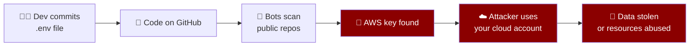
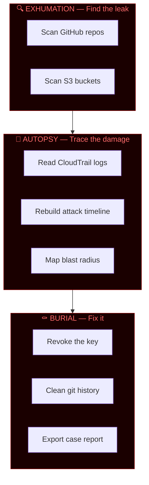
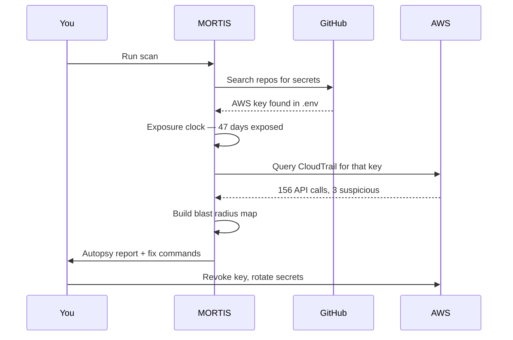
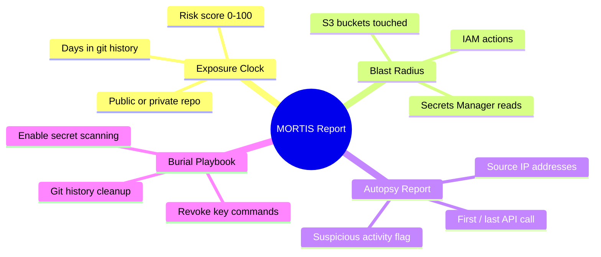
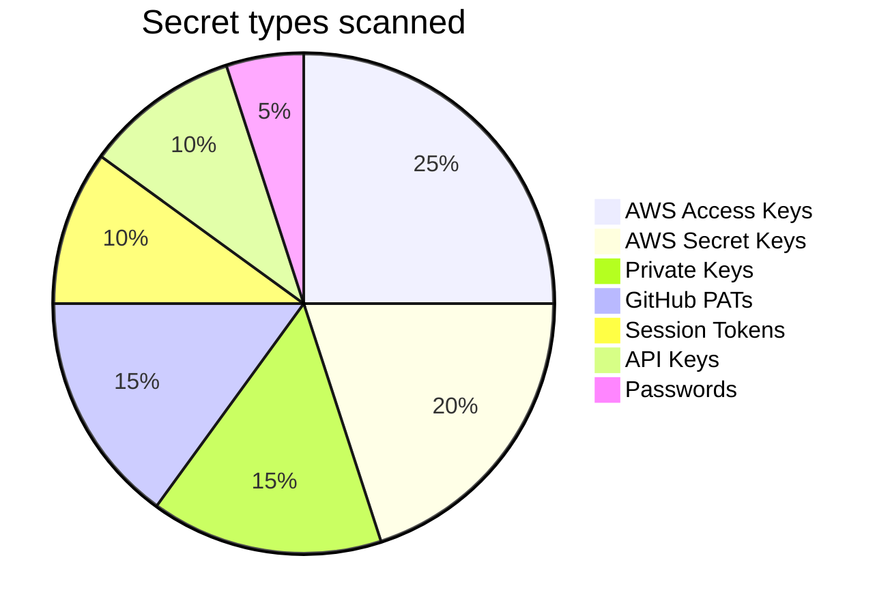
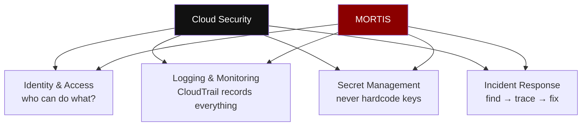

# MORTIS

**AWS Credential Forensics Engine**

> *Find the leak. Trace the damage. Fix it.*

Built by **Hassan Azeem** — [hazeem.org](https://hazeem.org) · [github.com/hassanazeem2](https://github.com/hassanazeem2)


---

## Why I built this

I'm learning **cloud security** — how to protect apps and data that live on AWS and other cloud platforms. In cybersecurity, one of the most common mistakes is simple: **someone accidentally pushes a secret key to GitHub**. Once that happens, bots can find it in minutes and use it to access your cloud account.

Most tools only tell you *"hey, you leaked a key."* I wanted to go further and ask:

- How long has it been exposed?
- Did anyone actually use it?
- What did they touch — S3 buckets, IAM users, secrets?
- What do I do right now to shut it down?

**MORTIS** is my answer. It's a hands-on project to practice real cloud forensics — the same kind of detective work security teams do after a breach. I'm building it to learn, but it actually works.

---

## The problem (in 30 seconds)



This happens **all the time**. Keys get hardcoded in config files, pushed to a repo, and forgotten. CloudTrail logs every API call — but most people never look until it's too late.

---

## How MORTIS works

MORTIS runs in three phases. Think of it like a security investigation:



| Phase | What it does | Plain English |
|-------|-------------|---------------|
| **Exhumation** | Scans GitHub & S3 | *"Dig up exposed secrets before attackers do"* |
| **Autopsy** | Reads CloudTrail | *"Figure out what the key was used for"* |
| **Burial** | Remediation playbook | *"Kill the key and clean up the mess"* |

---

## Full investigation flow



---

## What you get after a scan



Every session gets a **case ID** like `CASE-2026-06-19-A3F2` — so you can track investigations like a real incident.

---

## What it detects



| Type | Severity |
|------|----------|
| AWS Access Key | CRITICAL |
| AWS Secret Key | CRITICAL |
| Private Key (RSA/SSH) | CRITICAL |
| GitHub PAT | HIGH |
| Hardcoded passwords | MEDIUM |

---

## Quick start

```bash
git clone https://github.com/hassanazeem2/mortis.git
cd mortis

python3 -m venv .venv
source .venv/bin/activate
pip install -r requirements.txt

python mortis.py --setup    # one-time config
python mortis.py              # interactive menu
python mortis.py --demo       # try it instantly — no credentials needed
```

### One-liners

```bash
python mortis.py --scan-repo your-username/your-repo
python mortis.py --inspect AKIA0000000000000000
```

---

## Setup (first time only)

<details>
<summary><b>AWS — read-only IAM user</b></summary>

Create an IAM user with these permissions (read-only, no write access):

```json
{
  "Version": "2012-10-17",
  "Statement": [{
    "Effect": "Allow",
    "Action": [
      "cloudtrail:LookupEvents",
      "s3:ListAllMyBuckets",
      "s3:ListBucket",
      "s3:GetObject",
      "s3:GetBucketAcl",
      "iam:ListUsers",
      "iam:ListRoles"
    ],
    "Resource": "*"
  }]
}
```

</details>

<details>
<summary><b>GitHub — personal access token</b></summary>

1. Go to [github.com/settings/tokens](https://github.com/settings/tokens)
2. Create a token with **`repo`** read scope
3. Paste it during `python mortis.py --setup`

</details>

> Your keys are saved locally at `~/.mortis/config.json` — never committed to git.

---

## Cloud security concepts this teaches



| Concept | What it means | How MORTIS uses it |
|---------|--------------|-------------------|
| **IAM** | Who has permission to use your AWS account | Traces which keys made which API calls |
| **CloudTrail** | AWS's activity log — every button click gets recorded | Rebuilds the attack timeline |
| **Blast radius** | Everything an attacker could reach with one key | Maps S3, IAM, Secrets Manager access |
| **Least privilege** | Give keys only the permissions they need | Remediation playbook tells you to tighten IAM |
| **Secret scanning** | Automatically block keys from being pushed to git | Playbook links to GitHub security settings |

---

## Tech stack

| Tool | Purpose |
|------|---------|
| Python 3.11+ | Core language |
| [Typer](https://typer.tiangolo.com/) | CLI commands |
| [Rich](https://rich.readthedocs.io/) | Terminal UI |
| [Boto3](https://boto3.amazonaws.com/) | AWS SDK |
| [PyGithub](https://pygithub.readthedocs.io/) | GitHub API |

---

## Roadmap (v2)

- [x] `--demo` mode — try it without AWS/GitHub credentials
- [ ] SARIF export for GitHub Advanced Security
- [ ] Live CloudTrail watch mode
- [ ] Org-wide repo hygiene dashboard

---

## About

I'm **Hassan Azeem**, learning cloud and cyber security by building real tools. MORTIS started as a way to understand how credential leaks actually play out in the cloud — not just in theory, but by reading real logs and tracing real (test) incidents.

**[hazeem.org](https://hazeem.org)** · **[github.com/hassanazeem2](https://github.com/hassanazeem2)**
